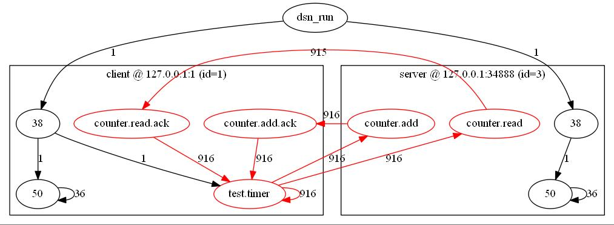
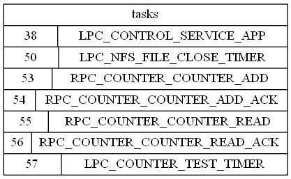
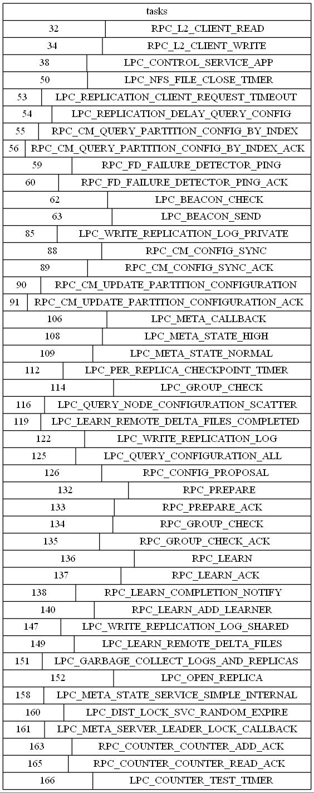

# rDSN.tools.explorer

A tool plugin for rDSN automatically extracts upper application/framework's execution flow.

Here is an example for a simple counter service where user requests are sent from one client to the server, and back to the client with the response. The edge lables are the flow weight (e.g., message count).




And here is a more complicated example for how the requests are handled in a replicated counter service with two replica servers, one meta server, and one client.





## How to build

```
dsn.run.sh build
dsn.run.sh install
```

Then you should find ```libdsn.tools.explore.so``` (or ```dsn.tools.explore.dll``` on Windows) under ```DSN_ROOT/lib```.

## How to use 

Currently, this toollet only works with the emulator tool, which requires all the nodes in the target distributed system in the same rDSN process. Here is a configurationf or the above client-server example.

```
[modules]
dsn.tools.common
dsn.tools.emulator
dsn.tools.explorer
counter 

[apps.server]
type = counter 
ports = 34888
pools = THREAD_POOL_DEFAULT

[apps.client]
type = counter.client 
arguments = localhost:34888
pools = THREAD_POOL_DEFAULT

[core]
toollets  = explorer 
tool = emulator

[tools.explorer]
dot = dot
```
Note the command for the [dot](http://graphviz.org/) tool is specified for automatically generating the jpeg graph. If not, the toollet will produce the raw dot description for being used further. 

For generating the dependency pictures, developers input ```explore``` in the local ```cli``` when the process runs, e.g., 

```
>explore
task deps dumped to C:\work\rDSN.tools.explorer\buildsln\bin\Debug\data\client/exp-1.jpg with labels in exp-1-labels.jpg
``` 

The toollet also supports cutomization of the output for different tasks. See options and examples below.
```
struct dot_task_config
{
    std::string dot_label;
    std::string dot_color;
    std::string dot_shape;
    std::string dot_style; // e.g., invis

    // source(outedge) has a higher priority
    std::string dot_out_style;
    std::string dot_out_color;
    std::string dot_in_style;
    std::string dot_in_color;
};
```

Sample configurations for the above client-server example.

```
[task.RPC_COUNTER_COUNTER_ADD]
dot_label=counter.add
dot_color = red 

[task.RPC_COUNTER_COUNTER_ADD_ACK]
dot_label=counter.add.ack
dot_color = red

[task.RPC_COUNTER_COUNTER_READ]
dot_label=counter.read
dot_color = red 

[task.RPC_COUNTER_COUNTER_READ_ACK]
dot_label=counter.read.ack
dot_color = red

[task.LPC_COUNTER_TEST_TIMER]
dot_label = test.timer 
dot_color = red
``` 
 


